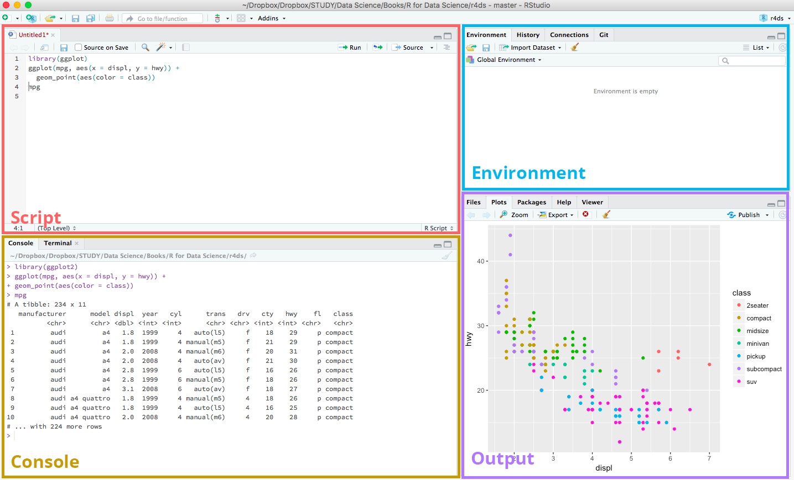

# R workshop

D7:3 retreat, Noors slott, 2018-08-30

## Rationale

Data acquisition is getting faster. Amount of data is increasing. You still have only two eyes and one brain. Ergo, we need better tools to represent complex data.

R is a tool of choice to ensure stable, reproducible, understandable, easily modifiable data representation.

## Goal 

R comes with a relatively high initial threshold. The goal of this three-hour workshop is to get over this initial workshop, and learn how to set it up, get it running, understand the basic concepts, and know where to look for help. 

As an example, you'll load your own data into R and produce a beautiful figure with it.

## Steps

1. Install R & Rstudio
1. First steps into R
1. Loading your own data
1. Your first figure

## Installing software

To start programming with R on your computer, you need two things: R and RStudio (actually only R, but RStudio makes the experience more enjoyable).

For your convenience, the required files are available on a USB stick during the workshop.

### Install R

To download R, go to [CRAN](https://cloud.r-project.org/) (the comprehensive R archive network). Choose your system and select the latest version to install.

### Install RStudio

You also can use a hefty tool to write and compile R codes. And RStudio is the most robust and popular IDE (integrated development environment) for R programming. [Download from RStudio](http://www.rstudio.com/download) (open source and for free).

## First RStudio session

### New RStudio project

* Start RStudio.
* Under the File menu, click on New project, choose New directory, then New project.
* Enter a name for this new folder, and choose a convenient location for it. This will be your working directory for the rest of the day (e.g., `~/RWorkshop`)
* Click on “Create project”
* Create a new R script (File > New File > R script) and save it in your working directory (e.g. introR.R)

### RStudio environment

Your RStudio environment is divided in several areas:


* *Script*: this is your source code, all the commands that allow you to produce the figures. Code should be mainly evaluated from here.
* *Console*: this is where you can try commands before storing them in the script, show values, debug functions, etc.
* *Environment*: this is where your files are stored in your file system.
* *Output*: where figures or files produced by the script/console are shown.

### Folders

You separate the original data (raw data) from intermediate datasets that you may create for the need of a particular analysis. For instance, you may want to create a `data/` directory within your working directory that stores the raw data, and have a `data_output/` directory for intermediate datasets and a `figure_output/` directory for the plots you will generate.

Create the following folders in the "Files" tab in the Output area:

* `data/`
* `data_output/`
* `figure_output/`

## Creating objects

Creating objects
Let’s start by creating a simple object:

```
x <- 10
x
```

We assigned to `x` the number 10. `<-` is the assignment operator. Assigns values on the right to objects on the left. Mostly similar to `=` but not always. Learn to use `<-` as it is good programming practice. Using `=` in place of `<-` can lead to issues down the line.

`=` should only be used to specify the values of arguments in functions for instance `read.csv(file="data/some_data.csv")`.

We can now manipulate this value to do things with it. For instance:

```
x * 2
x + 5
x + x

```
or we can create new objects using `x`:
```
y <- x + x + 5
```
Let’s try something different:
```
x <- c(2, 4, 6)
x
```
Two things:

* we overwrote the content of `x`
* `x` now contains 3 elements

Using the `[], we can access individual elements of this object:

```
x[1]
x[2]
x[3]
```

### Challenge

What is the content of this vector?

```
q <- c(x, x, 5)
```

We can also use these objects with functions, for instance to compute the mean and the standard deviation:

```
mean(x)
sd(d)
```

This is useful to print the value of the mean or the standard deviation, but we can also save these values in their own variables:

```
mean_x <- mean(x)
mean_x
```

## Sources / Read further

This tutorial is based on many great resources, but in particular:

* [R for data science](http://r4ds.had.co.nz/)
* Cecilia Lee's [Introduction to R Programming](https://cecilialee.github.io/blog/2017/12/05/intro-to-r-programming.html)
* François Michonneau's [R-class](http://r-bio.github.io/)
* Selva Prabhakaran's  [Top 50 ggplot2 Visualizations](http://r-statistics.co/Top50-Ggplot2-Visualizations-MasterList-R-Code.html)

#### Markdown

- Bulleted
- List

Another list 

1. Numbered
2. List

**Bold** and _Italic_ and `Code` text

[Link](url) and 
```

Commented area